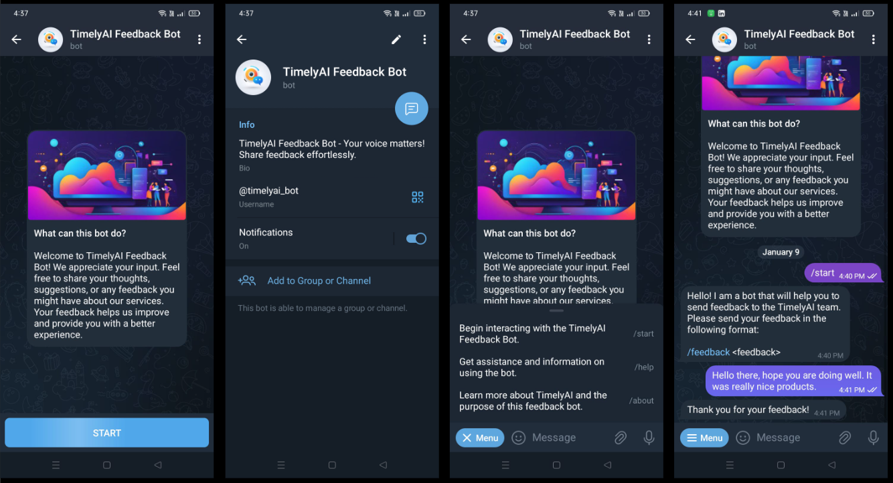

# FeedbackAI Project
## Overview

FeedbackAI is a project designed to facilitate companies in gathering feedback from users through a Telegram bot. The system is composed of three main components: the Telegram bot (@timelyai_bot), bot handler and the client application. The bot handlers handles user interactions on Telegram and adds the feedback to a distributed queue for real-time sharing. The client consumes the queue, stores feedback in MongoDB, and displays it to users in real-time through a web interface(socket).

## Snapshots


## Features
- Telegram Bot (`@feedbackai_bot`):
    -   `/start`: Initialize the conversation with the bot.
    -   `/help`: Get information about available commands.
    -   `/about`: Learn more about the bot.
    -   `/stop`: Stop the interaction with the bot.

- Real-time Feedback: User feedback submitted through the bot is added to a distributed queue for instant sharing.
- Client Application: 
    - Stores feedback data in MongoDB.
    - Provides a real-time web interface on 'localhost:5000' using sockets.
    - Displays feedback updates instantly.
    - Access all feedbacks at 'localhost:5000/feedbacks'.
    - Access the live feedbacks at `localhost:5000`.

## Getting Started

To utilize the example bot, you can simply run the client and the bot handler using Docker images. Follow the steps below to get started:

1. Run the Bot handler by executing the following command in the terminal:
    ```
    docker run -it goutamverma/feedback_db_server:latest
    ```

2. Run the client by executing the following command in the another terminal:
    ```
    docker run -it -p 5000:5000 goutamverma/feedback_bot_client
    ```

Once the Docker images are running, open your browser and visit 'localhost:5000' to access the 'Live Feedback' screen. You can generate feedback using the Telegram bot and see real-time updates on the web interface. To view all feedback, visit `localhost:5000/feedbacks`.

## Running the Project via Code
### Prerequisites
- Clone the GitHub repository to your local machine.
- Obtain a Telegram bot token from @BotFather on Telegram.
- In the `bot` directory, create a .env file and set the following values:
    ```
    #telegram credentials
    TOKEN = '{Telegram token}'
    BOT_USERNAME = '{Bot username}'

    #rabbitmq credentails
    QUEUE_URI = '{rabbitmq queue URL}'
    QUEUE_PASS = '{queue password}'
    QUEUE_USER = '{queue usename}'
    QUEUE_PORT = '{queue port}'
    ```
- In the `client` directory, create .env file and set the following values:
    ```
    #DB URL along with credentails
    DB_URI = '{mongoDB atlas URL}'

    #rabbitmq credentails
    QUEUE_URI = '{rabbitmq queue URL}'
    QUEUE_PASS = '{queue password}'
    QUEUE_USER = '{queue usename}'
    QUEUE_PORT = '{queue port}'
    ```


- Start the bot handler by running `python3 bot/bot.py`.
- Open another terminal, navigate to the client directory, and run `python2 app.py`.

Once the script start running, visit 'localhost:5000' in your browser to see the 'Live Feedback' screen. Generate feedback using the Telegram bot to see real-time updates on the web interface. To browse the all feedback visit `localhost:5000/feedbacks`

## Contributing
Contributions are welcome! Please fork the repository, create a branch, make your changes, and submit a pull request.


